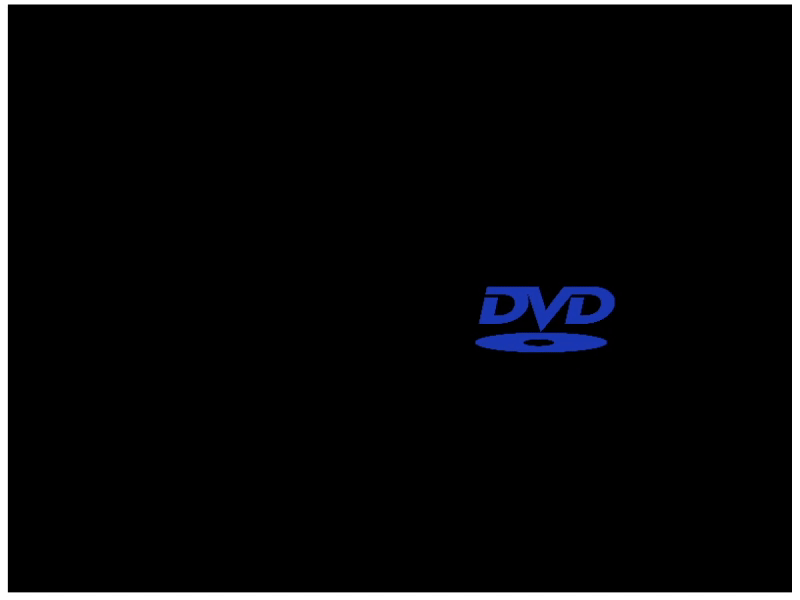
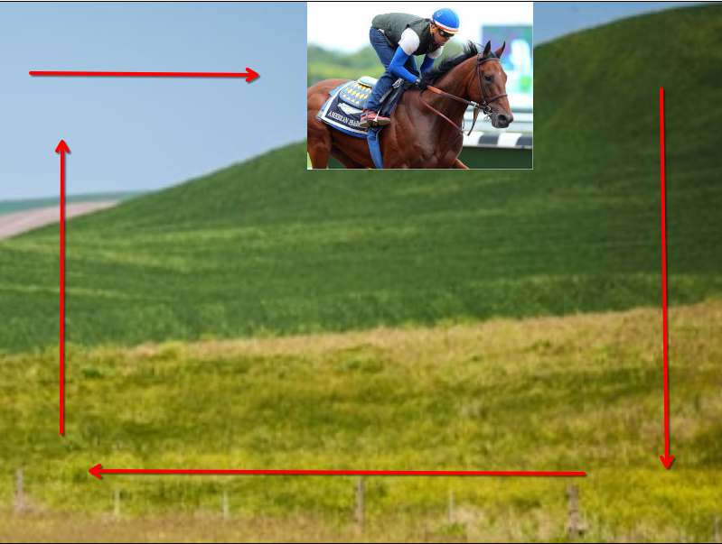
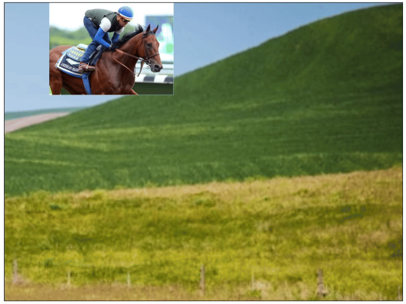

## Økt 2

### Før man starter:
- Det ligger en *mal* for oppsettet man trenger [her](canvas_mal.html) - om man skulle ønske et blankt *lerret* :P
- Bare å kopiere koden derfra inn i en ny fil i Visual Studio Code!

---

### Oppgave 1: Variabler

1) Lag to [variabler](https://www.w3schools.com/js/js_variables.asp) som skal tilsvare x og y posisjonen til en sirkel - sett de til en valid verdi, f.eks:
    - `let x = 50`
    - `let y = 50`
2) Bruk disse variablene for å lage en sirkel med `arc()`
3) Endre verdiene i `x` og `y` og lagre etter hver endring
    - Du burde se sirkelen flytte på seg!

### Oppgave 2: Endre størrelse

En [`arc()`](https://www.w3schools.com/tags/canvas_arc.asp) sin tredje verdi står for `radius`:

```js
ctx.arc(x, y, radius, startAngle, endAngle)
```

1) Lag enda en variabel for størrelsen - sett den til en valid verdi, f.eks:
    - `let size = 30`
2) Sett variablen inn på riktig sted i `arc()`
3) Endre verdien i `size` og lagre etter hver endring
    - Sirkelen burde endre størrelse!

### Oppgave 3: Tegn en sirkel ved bruk av en funksjon

Til nå så kjører koden vi skriver fra topp til bunns. Men ved hjelp av [**funksjoner**](https://www.w3schools.com/js/js_functions.asp) så kan vi velge hvor og når deler av koden skal kjøre!

1) Lag en funksjon som heter `move()`.
    - `function move(){}`
2) Mellom krøllparantesene (`{}`) kan vi trykke på *Enter* for et linjeskift
3) Fortsatt mellom krøllparantesene, så kan vi flytte vår sirkel:

```js
function move() {
    ctx.arc(x, y, size...)
    ctx.stroke()
}
```

4) Skriv en "`move()`" på linja *over* `function move()`
5) Sirkelen burde vise seg på skjermen!

### Oppgave 4: Få sirkelen til å flytte på seg

JavaScript har en innebygd funksjon som vi kan bruke for å lage en "animasjon" som heter [`requestAnimationFrame()`](https://www.w3schools.com/jsref/met_win_requestanimationframe.asp).

For å kjøre denne, så må vi sende med funksjonen vi laget!

1) Legg til en `requestAnimationFrame(move)` nederst i `move()` funksjonen.
    ```js
    move()
    function move() {
        ...
        requestAnimationFrame(move)
    }
    ```

Nå *animerer* vi teknisk sett, men vi må spesifisere hva som skal *endre* seg i `move()`-funksjonen.

2) Legg til en `x += 1` -  en linje over `requestAnimationFrame`
    - Sirkelen burde nå bevege seg horisontalt! Men som en svart stripe...
3) Helt i toppen av funksjonen, så burde vi "cleare" canvas før vi beveger oss. Legg til denne linja i toppen av `move()`:

```js
function move() {
    ctx.clearRect(0, 0, c.width, c.height)
    ...
```

- Du burde nå ha en sirkel som beveger seg horisontalt over skjermen!
  - Hvis det fortsatt er en svart stripe, så kan det hende du burde putte [`ctx.beginPath()`](https://www.w3schools.com/tags/canvas_beginpath.asp) rett over `ctx.arc()`.

4) Prøv selv!
    - Nå beveger sirkelen seg horisontalt, hvordan skal man få den til å bevege seg vertikalt?

### Oppgave 5: Få sirkel til å holde seg innenfor canvas

Nå forsvinner sirkelen ut av canvas, som kan være ukjekt - fordi vi helst vil se sirkelen...

Da må lage noen [`if`](https://www.w3schools.com/jsref/jsref_if.asp)-sjekker for å sjekke om sirkelen er der den skal være!

1) Legg til en ny variabel for fart sammen med de andre variablene, f.eks.
    - `let speed = 1`
2) Endre `x += 1` til `x += speed`
    - Hvis `speed` er satt til `1`, så vil du få samme resultat!
3) Inne i funksjonen, lag en ny linje hvor du skriver "`if()`".
    - Skriv inni parantesene:
    - `x > c.width`
    - Her sier vi: **Hvis x-positionen til sirkel er mer enn bredden på canvas**
4) Etter denne `if`-en, så kan vi skrive:
    - `speed = -speed`
    - Dette betyr: **Sett fart til negativ fart** (som da er motsatt retning)
5) Sirkel burde sprette i motsatt retning!
    <details>
      <summary>👈 Sjekk om du skrev if-en riktig!</summary>

      ```js
      if(x > c.width) speed = -speed
      ```
    </details>

**Bonus:**

- Nå går deler av sirkelen ut av rammen - **prøv å få hele sirkelen til å holde seg innenfor**! (Hint: Her må vi kanskje gjøre noe med `c.width`)
- Prøv å gjør det samme som vi har gjort, men vertikalt i stedet for horisontalt!

---

## Bonusoppgaver!

### DVD-logo!


Ta utgangspunkt i denne koden:
```html
<!DOCTYPE html>
<html lang="en">
<head>
    <meta charset="UTF-8">
    <meta name="viewport" content="width=device-width, initial-scale=1.0">
    <title>DVD</title>
    <style>
        canvas {
            background-color: black;
        }
    </style>
</head>
<body onload="drawImage()">
    <canvas id="fjernsyn" width="800" height="600"></canvas>
    
    <script>
        const c = document.getElementById('fjernsyn');
        const ctx = c.getContext('2d');
        const img = document.getElementById('img')
        
        
        function drawImage() {
            ctx.drawImage(img, 0, 0, 150, 75)

        }


    </script>
</body>
</html>


```
1) **Få logoen til å flytte på seg!**
    1) Lag `x` og `y` variabler på utsiden av funksjonen
    2) Sett variablene på riktig plass inne i [`drawImage()`](https://www.w3schools.com/graphics/canvas_images.asp)
    3) Skriv en linje i funksjonen som får `x` verdien til å endre seg! (Hint: `+=`)
    4) Skriv enda en linje i funksjonen som endrer `y` verdien!
2) **Lag variabler for fart!**
    1) Lag to variabler for fart i hver retning
        - `let xSpeed = 3`
        - `let ySpeed = 2`
    2) På linjene som beveger logoen, bytt ut tallet med disse variablene
3) ***Keep between the lines!* - Få logoen til å sprette fra sidene**
    - Lag `if`-sjekker for hver side av canvas
    1) Få logoen til å sprette vekk fra høyre "vegg" (Hint: `-xSpeed`)
    2) Få logoen til å sprette vekk fra "gulvet" (Hint: `-ySpeed`)
    3) Få logoen til å sprette vekk fra ventre "vegg" (Hint: [`Math.abs(xSpeed)`](https://www.w3schools.com/jsref/jsref_abs.asp))
    4) Få logoen til å sprette vekk fra "taket" (Hint: `Math.abs(ySpeed)`)
4) **Endre `xSpeed` og `ySpeed` til å treffe "kantene" oftere :P**

**BonusBonus!:** Prøv å flytt ut `if`-sjekkene til hver sin metode med [`return`](https://www.w3schools.com/jsref/jsref_return.asp)!

---

### Horseracer



(Løs detta med variabler og if-setninger! Ta utgangspunkt med koden under som mal!)

1) Få hesteridern inn i canvas! ([`drawImage()`](https://www.w3schools.com/graphics/canvas_images.asp))
    - Bildet skal stå helt oppe i venstre hjørne (0,0)
2) Få hesteridern til å bevege seg horisontalt
3) Når hesteridern treffer høyre "vegg", så skal den:
    1) Stoppe å gå til høyre
    2) Begynne å gå nedover
4) Når hesteridern treffer "gulvet", så skal den:
    1) Stoppe å gå nedover
    2) Begynne å gå til venstre
5) Når hesteridern treffer venstre "vegg", så skal den:
    1) Stoppe å gå til venstre
    2) Begynne å gå oppover
6) Når hesteridern da *igjen* treffer "taket", så skal den gå som fra start!

<details>
    <summary>👈 Resultat:</summary>


</details>
<br>
    

```html
<!DOCTYPE html>
<html lang="en">
<head>
    <meta charset="UTF-8">
    <meta name="viewport" content="width=device-width, initial-scale=1.0">
    <title>Document</title>
    <style>
        canvas {
            border: 1px solid black;
            background-image: url("https://kompis.s-ul.eu/zHiH1V9G");
        }
    </style>
</head>
<body>
    <canvas id="vanGogh" width="800" height="600"></canvas>
    
    <script>
        const c = document.getElementById('vanGogh');
        const ctx = c.getContext("2d");
        const img = document.getElementById('horse');

        // Skriv variabler her!

        
        move();
        function move() {
            ctx.clearRect(0, 0, c.width, c.height);
            // Tegn opp her!

            
            requestAnimationFrame(move)
        }

    </script>
</body>
</html>
```

**Troubleshooting:**
- Hvis bildet bare vandrer unna på utsiden av canvas, uansett hva man gjør i `if`-ene, så kan det hende man må ***stalle* bildeposisjonen** et lite splitt-sekund. 

<details>
    <summary>👈 Eksempel:</summary>

```js
if(x < 0) {
    x = 0 // eksplisitt si at bildet skal være inntil venstre vegg
    xSpeed = 0;
    ySpeed = -2;
}
// gjøre dette da med alle vegger, gulv og tak!
```
</details>
<br>
